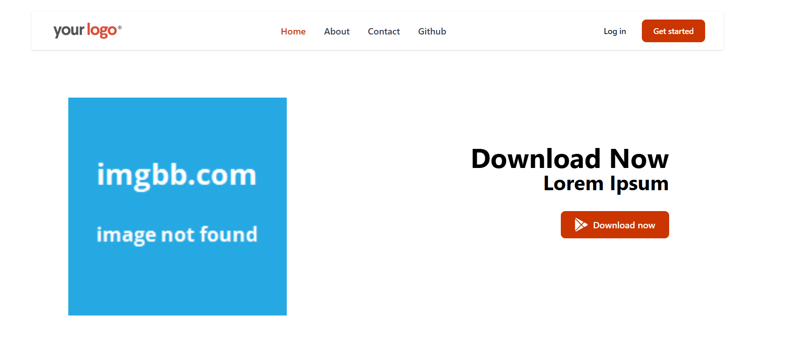

## Advanced React Learning

In **Advanced React**, I am exploring key concepts such as:

- **React Router DOM** – for seamless navigation and dynamic routing.
- **useContext API** – for efficient state management across components.

These concepts help in building **scalable** and **maintainable** applications by improving performance and simplifying data flow.

Additionally, I am diving deeper into other advanced React techniques to enhance my expertise in **modern web development**.

